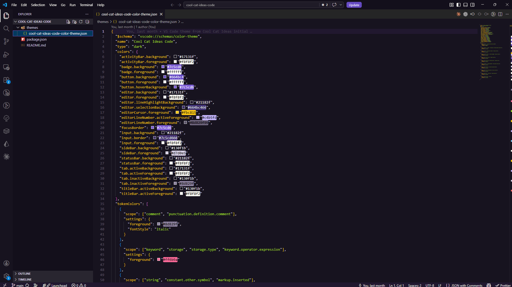

# Cool Cat Ideas Code

Dark VS Code theme matching the syntax coloring used in Cool Cat Ideas articles.

## Local Installation

1. Unzip this package.
2. Copy the `cool-cat-ideas-code` folder into your VS Code extensions directory:
   - Windows: `%USERPROFILE%\.vscode\extensions`
   - macOS/Linux: `~/.vscode/extensions`
3. Restart VS Code or run `Developer: Reload Window`.
4. Open `Preferences: Color Theme`.
5. Select `Cool Cat Ideas Code`.

Source repository:
https://github.com/cool-cat-ideas/cool-cat-ideas-code
